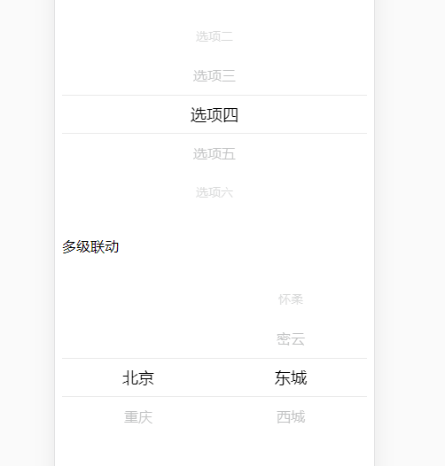

<big><h1 align="center">aw-picker</h1></big>

<p align="center">
  移动端最好用的的筛选器组件，高仿 ios 的 UIPickerView ，非常流畅的体验
</p>

## demo
相对目前已有的选择器更加顺滑 



## 安装
安装`aw-picker`
```shell
npm i aw-picker
```
引入
```js
import AwPicker from 'aw-picker'
```

## 使用方法

### 基本用法
```html
<aw-picker
  :datas="data1">
```
```js
data() {
  return {
    data1: [
        {
          values: [
            {
              label: '选项一',
              value: 1,
            },
            {
              label: '选项二',
              value: 2,
            },
          ],
        },
      ],
  }
}
```

### 多级联动
```js
const citys = [
  {
    label: '北京',
    value: 'beijing',
    children: [
      {
        label: '海淀',
        value: 'haidian',
      },
      {
        label: '朝阳',
        value: 'chaoyang',
      },
    ],
  },
  {
    label: '重庆',
    value: 'chongqing',
    children: [
      {
        label: '永川',
        value: 'yongchuan',
      },
      {
        label: '万州',
        value: 'wanzhou',
      },
    ],
  },
];

data() {
  return {
    data1: [
      {
        values: [],
        flex: 1,
        align: 'center',
      },
      {
        values: [],
        flex: 1,
        align: 'center',
      },
    ],
  }
},
created() {
    this.data1[0].values = citys;
    this.data1[1].values = citys[0].children;
  },
methods: {
  changeValue(pickerIndex, cityName) {
    if (pickerIndex === 0) {
      this.data1[1].values = citys.find(val => val.value === cityName.value).children;
    }
  },
},
```

## 数据格式

| 参数 | 说明 | 类型 | 默认值 |
|:---|:---|:---|:---|
| values | 展示数据`{label: xx, value: xx}` | Array | - |
| flex | 相当与`flex: n` | Number | 1 |
| value | 默认值 | Number, String | - |
| align | 对齐方式 | String | center |
| divider | 是否是分割块 | Boolean | false |
| content | 分割块的内容(`divider`为`true`生效) | String | - |
| dividerStyles | 分割块的样式 | Object | - |

## 事件
| 名字 | 说明 | 返回 | 
| --- | --- | --- |
| change | 当选中值发生改变的时候触发 | index: 第几个`picker`发生改变，val: 选中值的格式为`{label: xx, value: xx}`

## 方法
| 名字 | 说明 | 返回 | 
| --- | --- | --- |
| getChoiceList | 获取选中值列表 | 获取所有选中值组合列表，数据格式为`{label: xx, value: xx}`
| getPickerInstance | 获取`picker vue` 实例对象 | 

## Author
email: `18223306087@163.com`<br>
weChat: `18223306087`